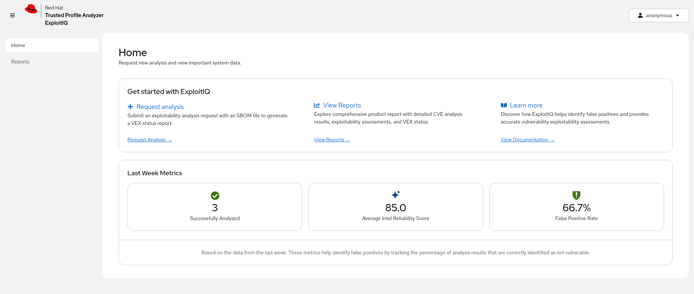
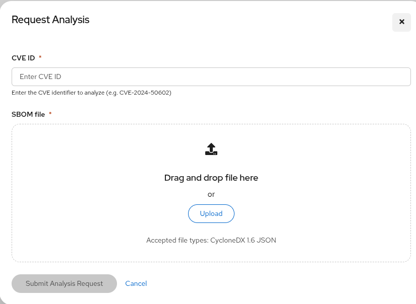
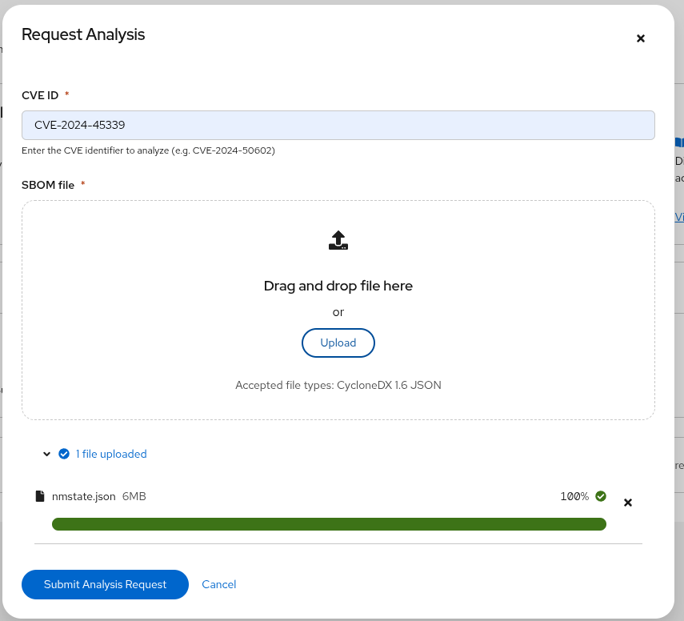
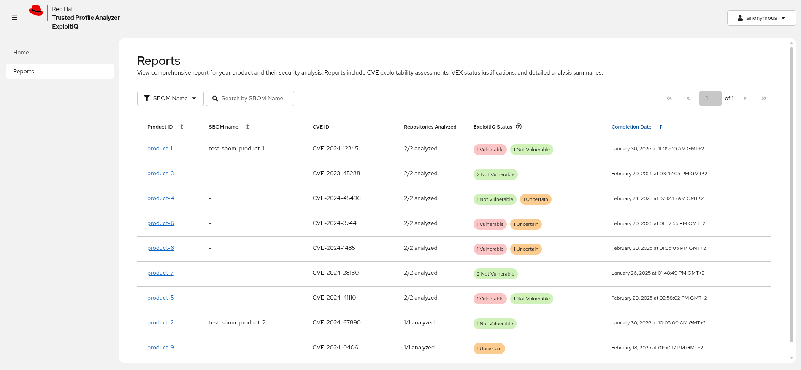
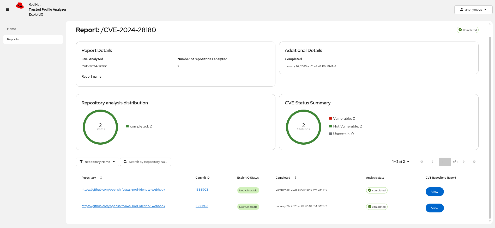
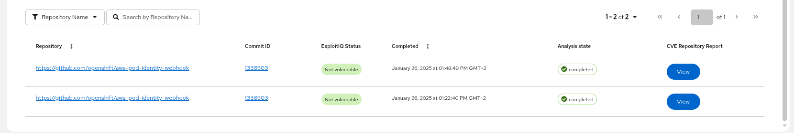
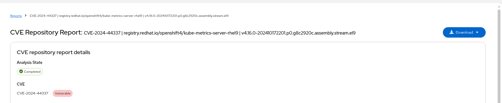
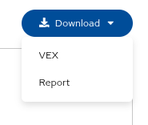

# ExploitIQ - Client

This project is a Quarkus + React web application implemented to interact with ExploitIQ service
for sending requests to evaluate vulnerabilities on specific SBOMs.

## Development

Check this other documents for:

* [Configuration](./docs/configuration.md)
* [Development](./docs/development.md)

## Using the Application

Open http://localhost:8080/

### Home Page

On the Home page, you will find a central dashboard designed to manage your exploitability analysis workflow and monitor recent system performance.

**Get Started with ExploitIQ**

In this section, you will find quick-access links to the core functions of the application: Request Analysis, View Reports, and Learn More.

**Last Week Metrics**

In this section, you will find a summary of system performance from the past seven days.

### Request Analysis

The _Request Analysis_ dialog provides a form where you can load a CycloneDX SBOM and enter a CVE to inspect. The `user name` will be automatically added as a metadata parameter.

Once you have uploaded an SBOM and entered the CVE ID, you will be able to submit the request:

After submitting the request, you will be redirected to the Report page. Once the analysis is complete, you will find a detailed report featuring the Agent's results for your request along with additional data insights.

**Note:** There is a configurable pool of concurrent requests. Any request that is submitted when the pool is full will be queued. If after a certain time a callback response is not received, the report will be _expired_ (failed).

### Reports Page

On this page, you will find a table containing all reports.

**Report Organization:** Each row represents a specific SBOM report, which may contain a single component (repository) or multiple components based on the original request file.

You will be able to sort, filter, and organize the reports table to quickly locate specific data.

After clicking a _Product ID_ link, you will find one of two views depending on the request type:

- **Single Component:** You will be taken directly to the detailed report page as described above.

- **Multiple Components:** You will be directed to an SBOM overview page that provides a high-level summary of results across all components.

### Report Page

On this page, you will find:

- **Report Details:** You will see general information about the report, including _overview statuses_ such as Repository Analysis Distribution and a CVE Status Summary, which provide high-level data on the SBOM and its associated CVEs.

- **Component Table:** Below the summary data, you will find a table listing all components included in the SBOM:

You will be able to sort, filter, and organize the reports to quickly locate specific data.

- **Direct Links:** You will find that the _Repository Name_ column links directly to the git repository, while the _Commit ID_ column links to the specific commit used in the analysis.

- **View Button:** Finally, By clicking the _View_ button, you will be taken to the detailed report page for that specific repository, the same page you would access directly for a single-component SBOM.

### Report

### Download Feature

A blue **Download** button is available on the repository report page, providing access to download either the VEX (Vulnerability Exploitability eXchange) data or the complete report as JSON files. The VEX option is only available when the component is in a vulnerable status and is automatically disabled otherwise.

